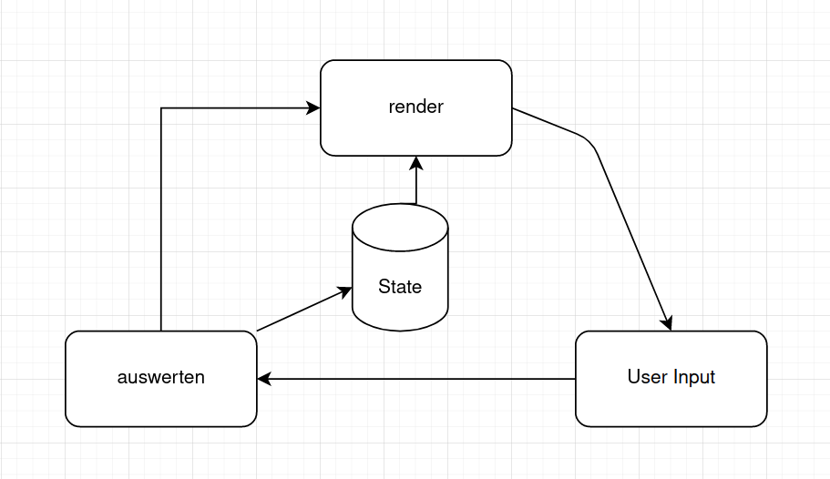

### Simple Gameloop example

## Simple Loop
So ist der Ablauf in diesem einfachen Beispiel:  
1. rendern (den Gamestate lesen und anzeigen)
2. input sammeln (Benutzer-Input abfragen)
3. gamestate update (Benutzer-Input auswerten und Gamestate updaten)
